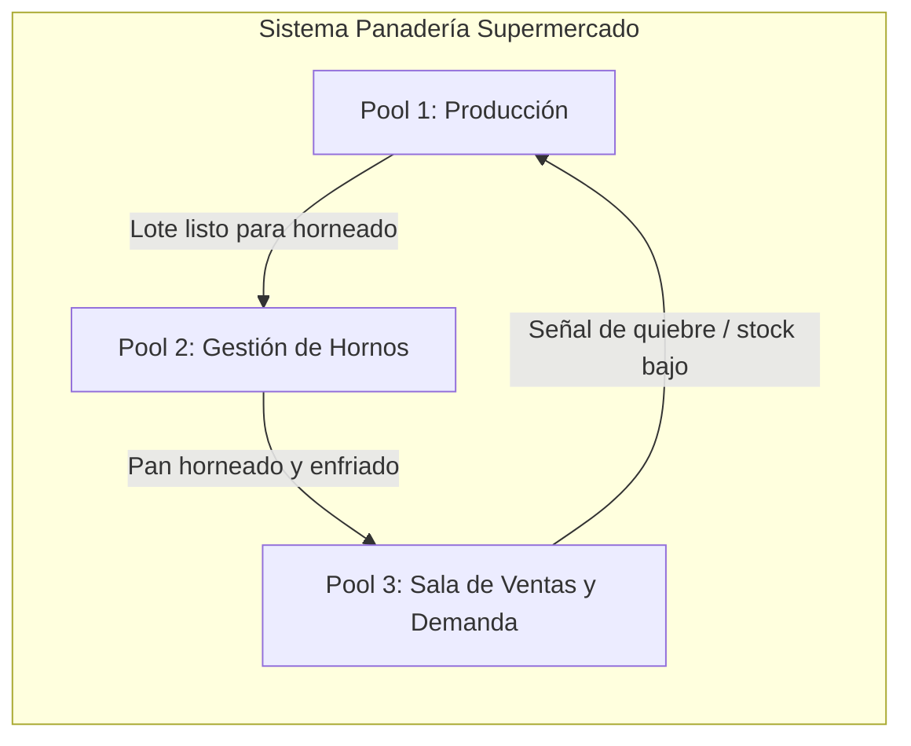
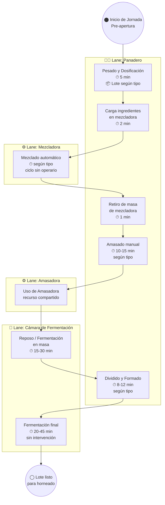
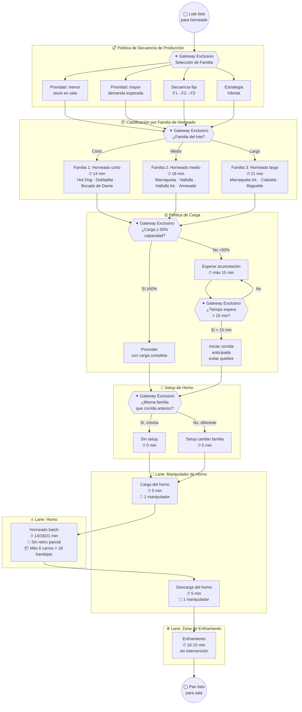
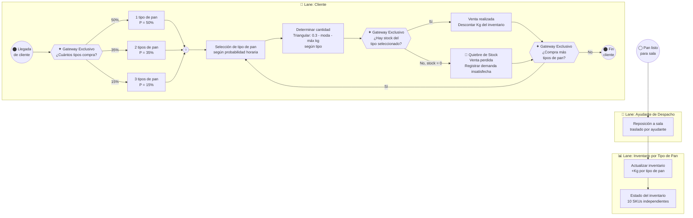
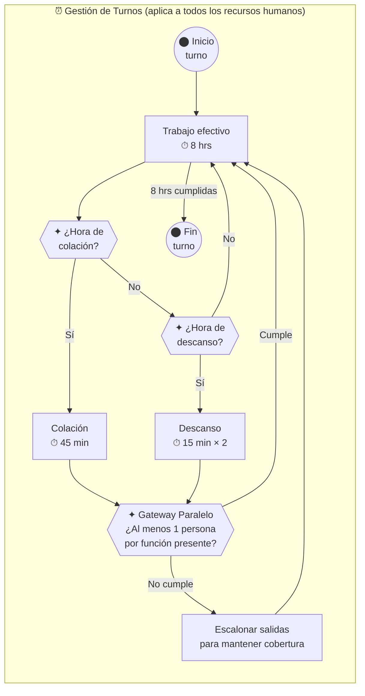
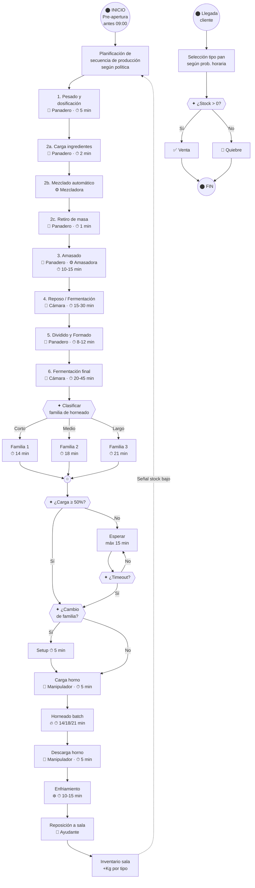

# Diagrama de Flujo BPMN 2.0 — Panadería de Supermercado

> [!NOTE]
> Diagrama construido bajo los principios **BPMN 2.0** para el proyecto de simulación de eventos discretos en SIMIO. Cubre los tres subsistemas principales: **Producción**, **Gestión de Hornos** y **Sala de Ventas / Demanda**.

---

## 1. Vista General de Pools e Interacciones

---

## 2. Pool 1 — Proceso de Producción (por tipo de pan)

> **Lanes:** Panadero · Mezcladora · Amasadora · Mesa de Formado · Cámara de Fermentación

### Detalle de tiempos por etapa y tipo de pan

| Tipo de Pan | Pesado | Amasado | Reposo | Formado | Ferm. Final | Horneado | Enfriado | Kg/Batch |
|---|---|---|---|---|---|---|---|---|
| Marraqueta | 5 | 12 | 15 | 10 | 35 | 18 | 12 | 60 |
| Hallulla | 5 | 14 | 20 | 12 | 30 | 18 | 12 | 55 |
| Marraqueta Integral | 5 | 13 | 18 | 10 | 40 | 21 | 12 | 60 |
| Hallulla Integral | 5 | 15 | 20 | 12 | 35 | 18 | 12 | 55 |
| Pan Hot Dog | 5 | 12 | 15 | 12 | 40 | 14 | 12 | 55 |
| Ciabatta | 5 | 10 | 30 | 8 | 45 | 21 | 15 | 50 |
| Baguette | 5 | 10 | 25 | 12 | 45 | 21 | 15 | 45 |
| Dobladita | 5 | 13 | 15 | 10 | 20 | 14 | 10 | 50 |
| Bocado de Dama | 5 | 12 | 15 | 10 | 30 | 14 | 10 | 25 |
| Amasado | 5 | 15 | 20 | 10 | 35 | 18 | 12 | 60 |

---

## 3. Pool 2 — Gestión de Hornos

> **Lanes:** Manipulador de Horno · Horno · Zona de Enfriamiento

### Restricciones clave del horno

| Parámetro | Valor |
|---|---|
| Capacidad máxima por corrida | 6 carros (racks) |
| Bandejas por carro | 18 |
| No mezclar familias | ✅ Obligatorio |
| Retiro parcial | 🚫 Prohibido |
| Carga mínima recomendada | 50% (600 kg) |
| Espera máxima pre-corrida | 15 min |
| Setup cambio de familia | 5 min |
| Carga/Descarga | 5 min c/u (1 manipulador) |

---

## 4. Pool 3 — Sala de Ventas y Demanda de Clientes

> **Lanes:** Manipulador/Ayudante de Despacho · Inventario Sala · Cliente

---

## 5. Proceso Transversal — Gestión de Turnos de Trabajo

---

## 6. Diagrama Integrado End-to-End (Flujo Principal)

---

## 7. Leyenda BPMN 2.0

| Símbolo | Significado BPMN |
|---|---|
| `(("⬤"))` | **Evento de inicio / fin** (Start / End Event) |
| `["..."]` | **Tarea** (Task / Activity) |
| `{{"✦ ..."}}` | **Gateway Exclusivo** (Exclusive Gateway — XOR) |
| `(("○"))` | **Gateway Paralelo / Merge** |
| `-->` | **Flujo de secuencia** (Sequence Flow) |
| `-.->` | **Flujo de mensaje** (Message Flow entre pools) |
| 👤 / 👷 | Recurso humano requerido (Panadero / Manipulador) |
| ⚙️ | Recurso de máquina requerido |
| 🧪 | Recurso de fermentación / cámara |
| ⏱ | Tiempo de la actividad |

---

## 8. Entidades del Modelo de Simulación

| Entidad | Descripción | Atributos clave |
|---|---|---|
| **Lote de Pan** | Entidad principal que fluye por producción | Tipo, familia, kg, etapa actual |
| **Cliente** | Entidad que consume inventario | Nº tipos a comprar, tipos seleccionados, kg por tipo |
| **Corrida de Horno** | Agrupación de lotes de misma familia | Familia, nº carros, kg total, tiempo cocción |

## 9. Recursos del Modelo

| Recurso | Tipo | Usado en etapas |
|---|---|---|
| Panadero | Humano (turno 8h) | Pesado, carga/retiro mezcladora, amasado, formado |
| Manipulador/Ayudante | Humano (turno 8h) | Carga/descarga horno, reposición a sala |
| Mezcladora | Máquina | Mezclado |
| Amasadora | Máquina | Amasado |
| Mesa de Formado | Estación | Dividido y formado |
| Cámara Fermentación | Espacio | Reposo, fermentación final |
| Horno | Máquina (batch) | Horneado |
| Carros/Bandejas | Transporte | Horneado, enfriamiento, traslado |
